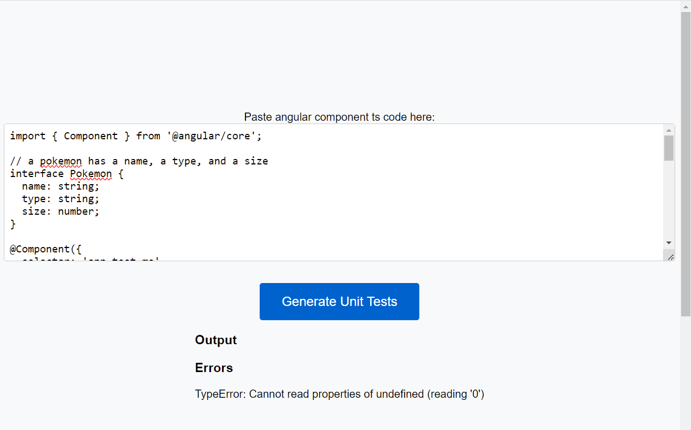
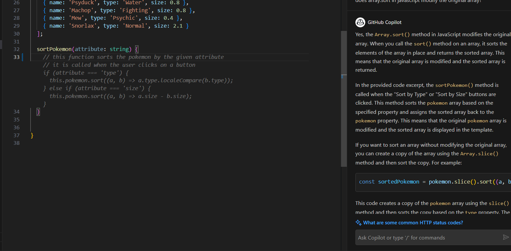

Playing around with github copilot. The goal is to make a working app without writing any code.

Github copilot: https://github.com/features/copilot

This app takes an angular component source code and generates unit tests for it.

Running app screenshot:

editor screenshot:

(note auto-complete function just given definition, and question/answer in the chat)

